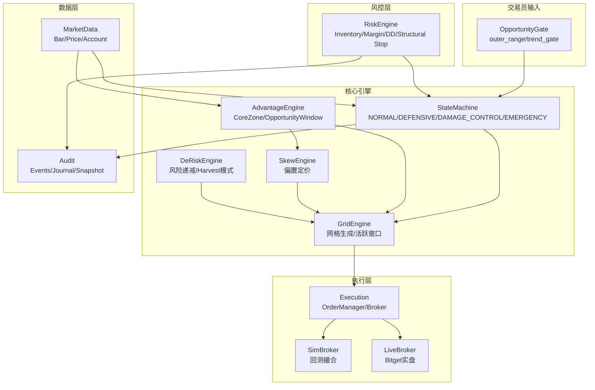

# 链动中性网格策略系统 - 完整开发计划

## 架构总览




## 波动率分层设计

| 波动率类型 | 用途层 | 具体应用 ||-----------|--------|----------|| **ATR** | 执行层 | grid spacing, core zone 宽度, stop buffer, re-anchor 偏移 || **RV** | 判断层 | regime filter, DEFENSIVE 触发, 参数组切换 (low-vol/high-vol preset) |---

## 关键业务决策（已拍板）

| 决策项 | 选择 | 说明 ||-------|------|------|| Breakeven 成本口径 | 交易口径 | avg_cost + fees + slippage，funding 单独核算 || 结构性破位参考边界 | outer_range | 以交易员输入的机会区间为基准 || 结构性破位确认方式 | 两阶段确认 | 价格确认(ATR buffer) + 时间确认(4H) || EMERGENCY 退出策略 | IOC分层退出 | 默认分3层退出，市价作为 fallback || SimBroker 费率 | Bitget实际 | maker 0.02%, taker 0.05%, 滑点 1bp |---

## 硬约束/红线细节（8项）

### 红线1: 审计前置到 M2

**原问题**: Audit 放在 M5 导致 M2/M3 关键行为无法验收**硬约束**:

- M2 结束前必须具备: `EventJournal` + `Snapshot` schema + append-only jsonl
- 从 M2 开始强制记录的事件类型:
                                                                                                                                                                                                                                                                - `STATE_CHANGE` - 状态迁移
                                                                                                                                                                                                                                                                - `RISK_TRIGGER` - 风控触发器激活
                                                                                                                                                                                                                                                                - `ORDER_BLOCKED` - 非法订单被拒绝
                                                                                                                                                                                                                                                                - `PARAM_UPDATE` - 参数更新
                                                                                                                                                                                                                                                                - `REANCHOR_REQUEST` - re-anchor 请求(accept/reject)
- **"没有审计事件 = 功能未交付"，禁止进入下一阶段**

---

### 红线2: 状态机强制动作绑定

**原问题**: 权限矩阵有了，但"进入状态的强制动作"没写死**强制动作表** (`src/state_machine/transitions.py`):| 状态迁移 | 强制动作 | 审计事件 ||---------|---------|---------|| ENTER DEFENSIVE | 1. cancel_non_core_buys() 2. freeze_new_buys = True 3. allow_sell_reduce = True | STATE_CHANGE + ORDER_CANCELLED || ENTER DAMAGE_CONTROL | 1. cancel_all_non_reduce_only() 2. reduce_only_mode = True 3. OrderManager enforce reduce-only | STATE_CHANGE + DAMAGE_CONTROL_ACTIVATED || ENTER EMERGENCY_STOP | 1. kill_switch = True 2. cancel_all_orders() 3. 执行IOC分层退出 4. 失败fallback市价退出 | EMERGENCY_STOP_TRIGGERED + EMERGENCY_EXIT_LAYER |**EMERGENCY_STOP 退出参数（写死）**:

```python
EXIT_LAYERS = 3
EXIT_RATIO_PER_LAYER = [0.30, 0.30, 0.40]
MAX_EXIT_DURATION_SEC = 60
ORDER_TYPE = "IOC"
REDUCE_ONLY = True
# Fallback条件: IOC失败 / API异常 / 超时 → 市价一次性退出
```

---

### 红线3: RiskEngine 触发绑定表

**原问题**: 触发器缺"触发→动作→审计→执行时点"绑定**触发绑定表** (`src/risk_engine/triggers.py`):| Trigger | 条件 | State Transition | Order Actions | Audit Event | Enforce Point ||---------|------|------------------|---------------|-------------|---------------|| InventoryWarn | inv_ratio >= 0.55 | NORMAL → DEFENSIVE | cancel_non_core_buys, freeze_new_buys | RISK_TRIGGER(INV_WARN) | on_fill || InventoryDamage | inv_ratio >= 0.70 | → DAMAGE_CONTROL | cancel_all_non_reduce_only, reduce_only_mode | RISK_TRIGGER(INV_DAMAGE) | on_fill || InventoryStop | inv_ratio >= 0.85 | → EMERGENCY_STOP | kill_switch, exit_sequence | RISK_TRIGGER(INV_STOP) | on_fill || MarginStop | margin_usage >= cap | → DAMAGE_CONTROL | reduce_only_mode | RISK_TRIGGER(MARGIN_STOP) | on_bar_close || DrawdownStop | DD >= max_dd | → EMERGENCY_STOP | kill_switch, exit_sequence | RISK_TRIGGER(DD_STOP) | on_bar_close || StructuralBreak | price_confirmed + time_confirmed | → DAMAGE_CONTROL | reduce_only_mode | BREAK_CONFIRMED | on_bar_close || EmergencyStop | API异常 / 流动性真空 | → EMERGENCY_STOP | kill_switch, market_exit | EMERGENCY_STOP_TRIGGERED | immediate |---

### 红线4: M3 最小门控 Stub

**原问题**: AdvantageEngine 在 M4，但 M3 的 GridEngine 可能先写歪**M3 必须实现的接口 stub** (`src/advantage_engine/stub.py`):

```python
class OpportunityStub:
    def valid(self) -> bool:
        """False时禁止新增网格，只允许减仓模式"""
        return True  # M3默认返回True，M4替换为真实逻辑
    
    def core_zone(self) -> tuple[float, float]:
        """返回(zone_low, zone_high)，GridEngine必须依据它调整spacing"""
        return (outer_range_low, outer_range_high)  # M3默认=outer_range
    
    def on_control_loop(self) -> None:
        """4H/1D调用，更新zone并写PARAM_UPDATE审计"""
        pass
```

**硬约束**: GridEngine 必须通过此接口获取 core_zone，不得硬编码---

### 红线5: SimBroker 保守模型

**原问题**: 只有 max_fills_per_bar，不足以防止"假精度回测"**默认配置** (`src/execution/sim_broker.py`):

```python
SIMBROKER_DEFAULTS = {
    "partial_fill_ratio": 0.8,           # 部分成交比例
    "fee_maker": 0.0002,                  # 0.02% (Bitget实际)
    "fee_taker": 0.0005,                  # 0.05% (Bitget实际)
    "slippage_bps": 1,                    # 1bp滑点
    "max_fills_per_bar": 3,              # 同bar最大成交数
    "fill_order": "inside_first",         # 先内层后外层
    "cancel_delay_bars": 1,               # 撤单延迟
    "cancel_fail_prob": 0.01,             # 1%撤单失败注入
}
```

**测试要求**: 必须有单元测试验证每个保守项生效---

### 红线6: 配置校验与危险配置拒绝

**原问题**: 阈值在 config 里但缺校验**ConfigValidator** (`src/utils/config_validator.py`):

```python
class ConfigValidator:
    INVARIANTS = {
        # 阈值单调性
        "inv_warn < inv_damage < inv_stop": lambda c: c.inv_warn < c.inv_damage < c.inv_stop,
        # 上下界
        "0.3 <= inv_warn <= 0.6": lambda c: 0.3 <= c.inv_warn <= 0.6,
        "0.5 <= inv_damage <= 0.8": lambda c: 0.5 <= c.inv_damage <= 0.8,
        "0.7 <= inv_stop <= 0.95": lambda c: 0.7 <= c.inv_stop <= 0.95,
        # 危险组合
        "zone_cover >= 0.5": lambda c: c.zone_cover >= 0.5,
        "N_buy_active >= 2": lambda c: c.N_buy_active >= 2,
    }
    
    def validate(self, config) -> list[str]:
        """返回所有违反的约束，空列表表示通过"""
        
    def enforce_or_exit(self, config):
        """校验失败则写CONFIG_INVALID审计事件并拒绝启动"""
```

---

### 红线7: Breakeven 成本口径

**决策**: 交易口径（avg_cost + fees + slippage，funding 单独核算）**数据模型** (`src/models/inventory.py`):

```python
@dataclass
class Breakeven:
    avg_cost: float              # 纯均价
    fees_cumulative: float       # 累计手续费
    slippage_cumulative: float   # 累计滑点
    
    @property
    def breakeven_price(self) -> float:
        """交易口径的盈亏平衡价"""
        return self.avg_cost + self.fees_cumulative + self.slippage_cumulative

@dataclass  
class PnLBreakdown:
    trading_pnl: float           # 交易盈亏
    fees: float                  # 手续费
    funding: float               # 资金费（单独核算）
    slippage: float              # 滑点
    total_pnl: float             # 总盈亏
```

**回测输出要求**: 必须拆分展示 trading_pnl / fees / funding / slippage---

### 红线8: 结构性破位工程口径

**决策**: 两阶段确认（价格确认 + 时间确认），以 outer_range 为基准**StructuralBreakDetector** (`src/risk_engine/structural_break.py`):

```python
@dataclass
class StructuralBreakConfig:
    reference_boundary: str = "outer_range"  # 以outer_range为基准
    atr_buffer_k: float = 0.5                # 价格确认: close > boundary + k*ATR
    time_confirm_hours: float = 4.0          # 时间确认: 累计停留时间 >= T
    
class StructuralBreakDetector:
    def on_bar_close(self, close: float, atr: float) -> BreakStatus:
        """
        返回:
    - NONE: 无破位
    - PRICE_CONFIRMED: 仅价格确认
    - FULLY_CONFIRMED: 价格+时间确认
        """
```

**确认规则**:

- 价格确认: `close > outer_range_high + 0.5*ATR` 或 `close < outer_range_low - 0.5*ATR`
- 时间确认: 累计在边界外停留时间 >= 4H（回到区间内计时清零）

**动作层级**:| 阶段 | 动作 ||-----|------|| Price confirmed only | NORMAL → DEFENSIVE, 启动 De-risk || Price + Time confirmed | 允许 StructuralStop / Re-anchor 评估 || Confirmed + 风险恶化 | → EMERGENCY_STOP |**审计事件**: BREAK_DETECTED / BREAK_PRICE_CONFIRMED / BREAK_FULLY_CONFIRMED / BREAK_RESET---

## 模块开发计划

### Phase 1: 基础架构与数据层 (M1)

**目标**: 建立项目骨架、数据模型、配置系统

1. **项目结构重组**

- 按工程规格文档创建目录结构
- 迁移/保留 `exchange/bitget.py` 作为 LiveBroker 基础
- 保留 `utils/indicators.py` 中的 ATR 计算

2. **数据模型定义** (`src/models/`)

- `StrategyState`: 四态枚举 + 权限矩阵
- `Inventory`: position_qty, inventory_ratio, inventory_slope（含 Breakeven，见红线7）
- `GridLevel`: price, side, size, reduce_only, tag
- `AuditEvent`: event_type, timestamp, reason, snapshot

3. **配置系统** (`config/grid_strategy.yaml`)

- 交易员输入: outer_range, trend_gate, allow_mild_bias
- 风控阈值: inv_warn=0.55, inv_damage=0.70, inv_stop=0.85
- Grid 参数: N_buy_active, M_sell_active, edge_band
- Zone 参数: T_zone=48h, zone_cover=0.65
- **ConfigValidator**: 启动时校验（见红线6）

4. **MarketData 模块** (`src/market_data/`)

- `BarFeed`: 支持 API 拉取 + 本地缓存 (Parquet)
- `AccountState`: equity, margin_usage, liq_distance
- `ReplayMarketData`: 回测数据回放器

**M1 DoD（可验收）**:

- [ ] 配置加载成功且通过 ConfigValidator 校验
- [ ] BarFeed 能拉取/缓存/回放历史数据
- [ ] 数据模型单元测试覆盖（StrategyState / Inventory / GridLevel / AuditEvent）
- [ ] Breakeven 数据模型包含 avg_cost + fees_cumulative + slippage_cumulative

---

### Phase 2: 状态机与风控引擎 (M2)

**目标**: 实现四态状态机 + 硬风控触发器 + **审计基础设施（前置）**

1. **审计基础设施（前置）** (`src/audit/`)

- `EventJournal`: append-only jsonl 写入器
- `Snapshot`: 完整状态快照 schema
- **强制事件类型**: STATE_CHANGE / RISK_TRIGGER / ORDER_BLOCKED / PARAM_UPDATE / REANCHOR_REQUEST
- **"没有审计事件 = 功能未交付"**

2. **StateMachine** (`src/state_machine/`)

- 状态: NORMAL / DEFENSIVE / DAMAGE_CONTROL / EMERGENCY_STOP
- 权限矩阵:
  ```javascript
        NORMAL:         允许新增buy, 允许补buy, 允许sell
        DEFENSIVE:      冻结新增buy, 禁止补buy, 允许sell减仓
        DAMAGE_CONTROL: 禁止所有buy, reduce-only
        EMERGENCY_STOP: 停止网格, 紧急退出
  ```


- **强制动作绑定**: 见红线2，每次状态迁移必须执行对应的 order actions 并写审计

3. **RiskEngine** (`src/risk_engine/`)

- **触发绑定表**: 见红线3，7个触发器完整实现
- `InventoryStop`: inventory_ratio >= 0.85 → EMERGENCY_STOP
- `RiskBudgetStop`: margin_usage >= cap 或 DD >= max_dd
- `StructuralStop`: **两阶段确认**（见红线8）
- `EmergencyStop`: liquidity_gap / API 异常
- `StructuralBreakDetector`: 价格确认(ATR buffer) + 时间确认(4H)

4. **波动率计算** (`src/utils/volatility.py`)

- `ATRCalculator`: 执行层波动率, 用于 spacing/buffer
- `RVCalculator`: 判断层波动率, 用于 regime filter
- `VolSpikeDetector`: vol_spike 信号生成

**M2 DoD（可验收）**:

- [ ] **审计三件套**: 任一 risk trigger 触发 → 状态迁移 + 强制订单动作 + audit 必须在同一事件循环内完成
- [ ] **权限 enforce**: 任一状态下 OrderManager 必须拒绝非法订单并写 ORDER_BLOCKED
- [ ] **最小 replay 验证**: inv_stop 触发 → DAMAGE_CONTROL 生效 → 审计可查
- [ ] **结构性破位**: 两阶段确认逻辑通过单元测试（价格确认 + 时间确认）
- [ ] **配置校验**: 危险配置组合被拒绝启动并写 CONFIG_INVALID

---

### Phase 3: 网格引擎与订单管理 (M3)

**目标**: 实现网格生成、活跃窗口、边缘递减 + **门控接口** + **保守回测模型**

1. **OpportunityStub（前置）** (`src/advantage_engine/stub.py`)

- **M3 必须先实现门控接口**（见红线4）
- `valid()`: False 时禁止新增网格
- `core_zone()`: 返回区间，GridEngine 必须依据它调整 spacing
- **硬约束**: GridEngine 不得硬编码 core_zone

2. **GridEngine** (`src/grid_engine/`)

- `GridBuilder`: 基于 ATR 生成网格层级，**必须通过 OpportunityStub 获取 core_zone**
- `ActiveWindow`: N_buy_active / M_sell_active 限制
- `EdgeDecay`: 边缘递减机制 (edge_band, edge_decay_factor)
- `SpacingManager`: 
                                                                                                                                                                                                                                                                - core 区: step_core = base_step * 0.7
                                                                                                                                                                                                                                                                - buffer 区: step_buffer = base_step * 1.3

3. **Execution** (`src/execution/`)

- `OrderManager`: desired_orders vs current_orders 差量计算，**enforce 状态权限**
- `LiveBroker`: 封装 BitgetClient, 支持 reduce-only
- `SimBroker`: **保守模型**（见红线5）
                                                                                                                                - partial_fill_ratio: 0.8
                                                                                                                                - fee_maker: 0.02%, fee_taker: 0.05%
                                                                                                                                - slippage_bps: 1
                                                                                                                                - max_fills_per_bar: 3
                                                                                                                                - fill_order: inside_first
                                                                                                                                - cancel_delay_bars: 1
                                                                                                                                - cancel_fail_prob: 0.01

4. **状态权限集成**

- GridEngine 根据当前 state 决定允许行为
- DEFENSIVE: 撤销外层高风险 buy, 冻结新增
- DAMAGE_CONTROL: 仅生成 reduce-only 订单

**M3 DoD（可验收）**:

- [ ] **状态敏感**: GridEngine 在不同 state 下生成的订单集合必须不同（单测对比）
- [ ] **门控接口**: GridEngine 必须通过 OpportunityStub 获取 core_zone（不得硬编码）
- [ ] **保守项验证**: SimBroker 8项保守配置全部生效（有单测验证每项）
- [ ] **4类行情 Replay**: 震荡/单边/破位/gap 场景，审计可复盘
- [ ] **OrderManager enforce**: 非法订单被拒绝并写 ORDER_BLOCKED

---

### Phase 4: 优势识别与进攻引擎 (M4)

**目标**: 实现 Adaptive Core Zone、机会窗口、Skew（替换 M3 的 Stub）

1. **AdvantageEngine** (`src/advantage_engine/`)

- **替换 OpportunityStub 为真实实现**
- `OpportunityWindow`: 机会是否仍成立
                                                                                                                                - cycle_activity: 震荡循环活跃度
                                                                                                                                - inv_reversion_speed: 库存回中速度
                                                                                                                                - breakeven_slope: 成本改善速度
- `CoreZoneCalculator`: 优势集中区域
                                                                                                                                - fill_density 统计
                                                                                                                                - adv_score 计算
                                                                                                                                - zone_cover >= 0.65 选取
- `on_control_loop()`: 4H/1D 更新，**写 PARAM_UPDATE 审计**

2. **SkewEngine** (`src/skew_engine/`)

- **三重门控**: state==NORMAL + price∈core_zone + inv_ratio<=0.40
- 偏置计算: 避免"越跌越买"
- skew_max 上限 0.25
- **门控失败时写审计事件**

3. **DeRiskEngine** (`src/derisk_engine/`)

- 触发条件: 边际效率下降 / breakeven 变平 / house-money / 超时
- 动作: 关闭 skew → 收缩窗口 → 提高 step → Harvest-to-Exit
- **每个 De-risk 动作写审计事件**

**M4 DoD（可验收）**:

- [ ] CoreZone 计算逻辑正确（fill_density 统计 + zone_cover 选取）
- [ ] Skew 三重门控生效（单测验证门控条件）
- [ ] DeRisk 触发条件可配置且有审计
- [ ] control_loop 更新 core_zone 时写 PARAM_UPDATE
- [ ] 替换 Stub 后 GridEngine 行为变化符合预期

---

### Phase 5: 回测框架与运行时 (M5)

**目标**: 回测框架、双循环运行时、端到端集成（审计已在 M2 前置完成）

1. **Audit 增强** (`src/audit/`)

- **M2 已完成基础设施**，M5 补充:
- 完整事件类型: REANCHOR / EMERGENCY_STOP / FORCED_EXIT / EMERGENCY_EXIT_LAYER / EMERGENCY_EXIT_FALLBACK
- `Snapshot`: 完整状态快照 (price, state, inventory, breakeven, orders)

2. **回测框架** (`run/run_backtest.py`)

- `ReplayEngine`: 顺序回放历史 bar
- 事件: BAR_CLOSE / VIRTUAL_PRICE_TOUCH / FILL / EXCHANGE_FAULT
- **PnL 输出必须拆分**: trading_pnl / fees / funding / slippage（见红线7）
- **SimBroker 保守模型必须启用**

3. **运行时** (`run/`)

- `trade_loop`: 事件驱动, 处理成交/风险/状态机/下单
- `control_loop`: 4H/1D 定时, 更新 vol/spacing/core_zone/derisk
- **两个循环都必须写审计事件**

4. **持久化与恢复**

- `state_store.json`: 断电恢复（包含完整状态）
- `fills.parquet`: 成交记录
- `metrics_store.parquet`: 时间序列指标

**M5 DoD（可验收）**:

- [ ] 双循环运行（trade_loop + control_loop）集成测试通过
- [ ] 状态持久化与恢复正确（断电重启后状态一致）
- [ ] 全流程审计可复盘（从启动到退出的完整事件链）
- [ ] 回测输出拆分 PnL 组成（trading_pnl / fees / funding / slippage）
- [ ] EMERGENCY_STOP 退出流程完整测试（IOC分层 + 市价fallback）

---

## 最终目录结构

```javascript
taoquant-grid/
├── config/
│   └── grid_strategy.yaml
├── src/
│   ├── models/
│   │   ├── __init__.py
│   │   ├── state.py          # StrategyState, 权限矩阵
│   │   ├── inventory.py      # Inventory, Breakeven, PnLBreakdown (红线7)
│   │   ├── grid.py           # GridLevel, GridOrder
│   │   └── events.py         # AuditEvent
│   ├── market_data/
│   │   ├── __init__.py
│   │   ├── feeds.py          # BarFeed, ReplayMarketData
│   │   └── account.py        # AccountState
│   ├── state_machine/
│   │   ├── __init__.py
│   │   ├── states.py         # 四态定义
│   │   └── transitions.py    # 迁移规则 + 强制动作绑定 (红线2)
│   ├── risk_engine/
│   │   ├── __init__.py
│   │   ├── triggers.py       # 风控触发绑定表 (红线3)
│   │   ├── stops.py          # 各类 Stop
│   │   └── structural_break.py  # 两阶段确认 (红线8)
│   ├── advantage_engine/
│   │   ├── __init__.py
│   │   ├── stub.py           # M3 门控接口 (红线4)
│   │   ├── opportunity_window.py  # M4 替换 stub
│   │   ├── core_zone.py
│   │   └── metrics.py
│   ├── grid_engine/
│   │   ├── __init__.py
│   │   ├── grid_builder.py
│   │   ├── active_window.py
│   │   └── spacing.py
│   ├── skew_engine/
│   │   ├── __init__.py
│   │   └── skew.py
│   ├── derisk_engine/
│   │   ├── __init__.py
│   │   ├── derisk.py
│   │   └── harvest_mode.py
│   ├── execution/
│   │   ├── __init__.py
│   │   ├── order_manager.py
│   │   ├── live_broker.py    # 封装 BitgetClient
│   │   └── sim_broker.py     # 回测撮合 + 保守模型 (红线5)
│   ├── audit/
│   │   ├── __init__.py
│   │   ├── events.py
│   │   ├── journal.py        # M2 前置实现 (红线1)
│   │   └── snapshot.py
│   └── utils/
│       ├── __init__.py
│       ├── volatility.py     # ATR + RV 计算
│       ├── config_validator.py  # 配置校验 (红线6)
│       └── types.py
├── run/
│   ├── run_trade_loop.py
│   ├── run_control_loop.py
│   └── run_backtest.py
├── tests/
│   ├── test_state_machine.py
│   ├── test_risk_triggers.py
│   ├── test_structural_break.py  # 两阶段确认测试
│   ├── test_simbroker_conservative.py  # 保守模型测试
│   ├── test_core_zone.py
│   └── test_reanchor_rules.py
├── data/
│   ├── state_store.json
│   ├── fills.parquet
│   └── metrics_store.parquet
└── logs/
    ├── trade.log
    ├── control.log
    └── audit_events.jsonl
```

---